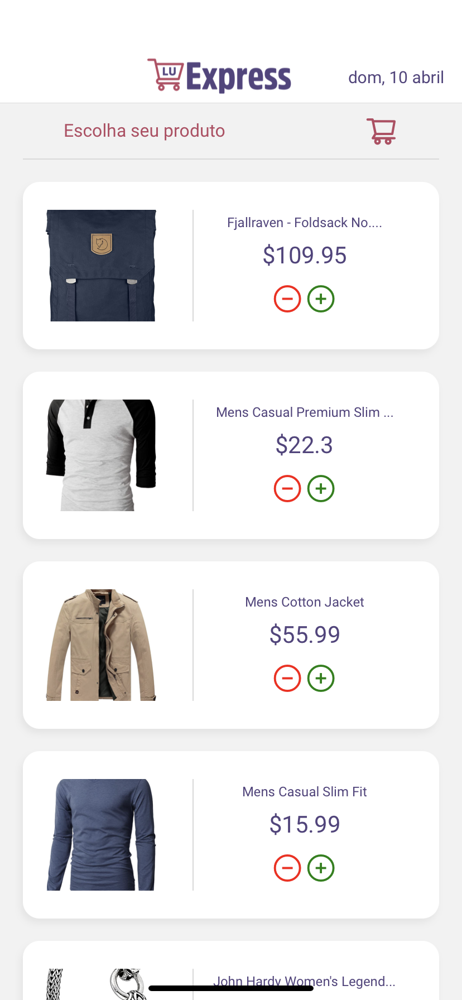
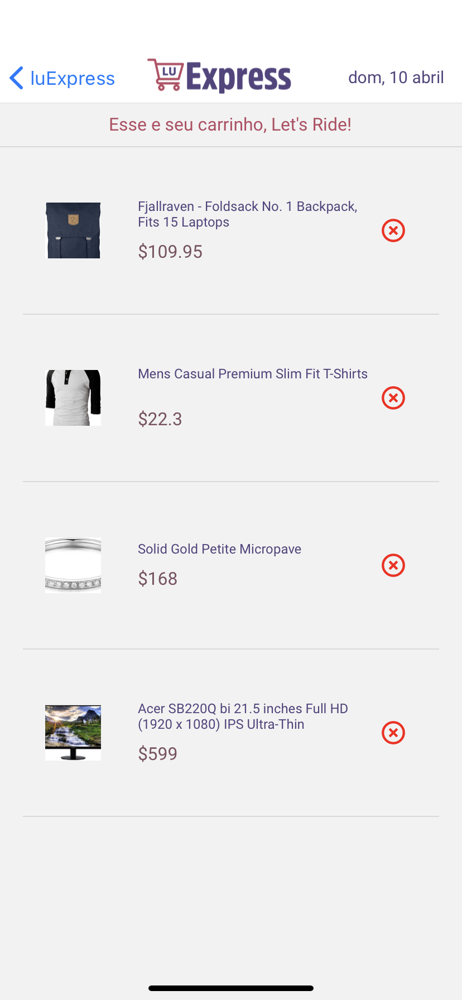
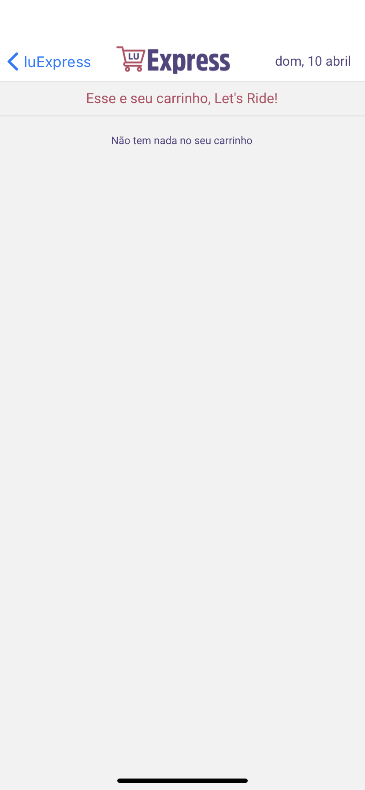
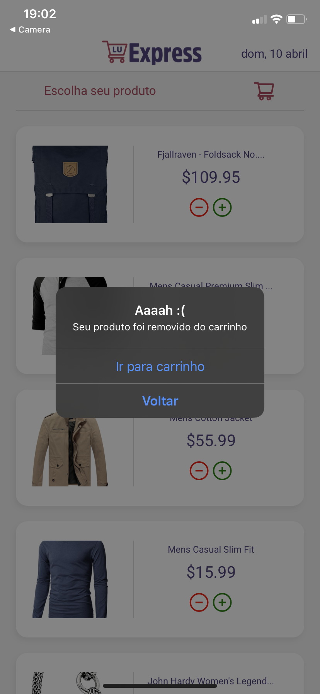
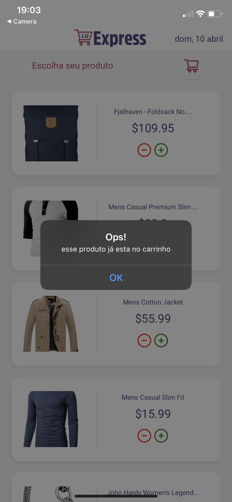
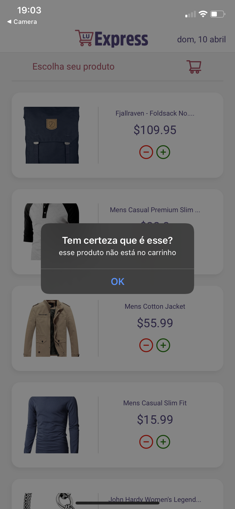

<h1 align="center"></h1>
luExpress é um projeto simples criado com React Native. O objetivo do app é carregar um banco de produtos com uma API externa e ter a possibilidade de adicionar e remover o produto do carrinho de compras.

## Ferramentas Usadas
#### React Native | Expo | Axios | Typescript | React Navigation 
<br>
Foi utilizado uma API pública chamada <strong>Fake Store</strong> que contém uma gama de produtos contendo imagens, títulos, preços, etc...
<br>
Para saber mais sobre essa API <a href="https://fakestoreapi.com/" target="blank">clique aqui</a>

## Requisitos para o projeto
É necessário ter a versão <strong>Node 12 LTS</strong> ou superior, para mais informações sobre como atualizar <a href="https://nodejs.org/en/" target="blank">clique aqui</a>
<br>
Também é necessário <strong>Explo CLI</strong> que foi utilizado durante todo o desenvolvimento do projeto, para instalar rode esse comando no seu terminal:
```
npm install -g expo-cli
```
ou
```
yarn add -g expo-cli
```
## Rodando o Projeto 
Após ter instalado o Expo CLI, é necessário fazer clonar o repositório com o comando
```
git clone https://github.com/luccaslombardi/ton-luexpress.git
```
Logo após clonar o repositório e tiver acessado a pasta do app é necessário instalar as dependências do projeto com o comando
```
npm install
```
ou
```
yarn add
```
Depois que o Explo CLI estiver instalado, o repositório clonado e as dependências instaladas rode este comando
```
expo start
```
Depois disso o Expo irá começar a rodar um local dahsboard com as opções para buildar o app, você poderá escolher rodar o app em um emulador Android, emulador iOS (para usuários de MacOS), rodar no seu próprio dispositivo lendo um QR Code ou rodar no próprio navegador (caso seu dispositivo não consiga rodar um emulador)
OBS: Caso tenha dúvidas, leia a documentação sobre <a href="https://docs.expo.dev/" target="blank">Expo Dev</a>

## App Overview
<p align="center">



</p>
<br>
<ul>
<li>Ao rodar a aplicação será mostrado a Home Page (Print 1) com todo os produtos carregados da API, será feito uma filtragem para aparecer apenas a imagem, o título e o preço dos produtos;</li>
<li>Cada produto terá a opção de ser adicionado ou removido do carrinho de acordo com os ícones de + e - (Print 1);</li>
<li>O usuário poderá clicar no ícone do carrinho para a acessar o mesmo;</li>
<li>Após clicar o carrinho será feito uma busca para saber se existe algum produto no carrinho, caso tenha será carregado na tela (Print 2), caso não será carregada a imagem do Print 3;</li>
<li>O usuário também terá a possibilidade de excluir um item diretamente do carrinho cliando no ícone (Print 3)</li>
</ul>
OBS: Neste App náo e possível adicionar mais quantidades do mesmo produto no carrinho.

## Lidando com Erros (Bonus)
<p align="center">




</p>
<br>
<ul>
<li>Para melhorar a UX e evitar mitigar erros, foi criado uma funcionalidade com alertas</li>
<li>Após o usuário adicionar um produto no carrinho será emitido um alerta para ficar claro que o produto foi adicionado com sucesso (Print 1);</li>
<li>Caso o usuário queira remover o item do carrinho direto da Home Page também será emitido um alerta após o botão para remoção ser clicado (Print 2);</li>
<li>Existe a possibiliade do usuário apertar o botão para adicionar um produto já existente no carrinho, para isso é disparado um alerta caso o botão de adicionar seja clicado nesse caso (Print 3);</li>
<li>O mesmo ocorre para caso o usuário tente remover um item que não esteja no carrinho pela Home Page, para isso e emitido um outro alerta (Print 4)</li>
</ul>

## Criador
Dev: <a href="https://github.com/luccaslombardi" target="blank">Luccas Lombardi</a>
